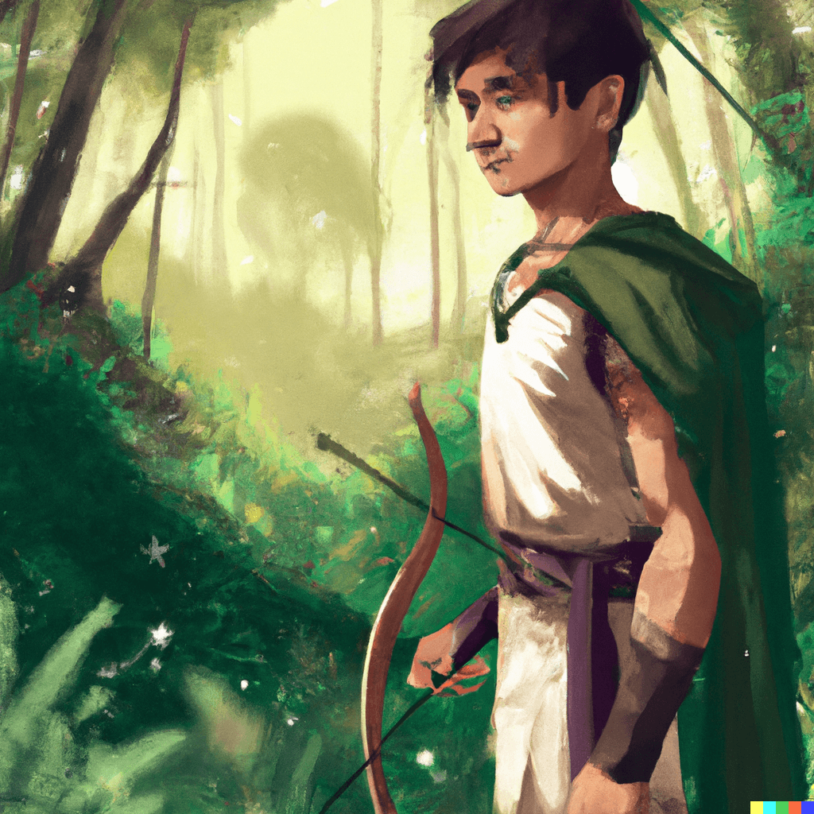
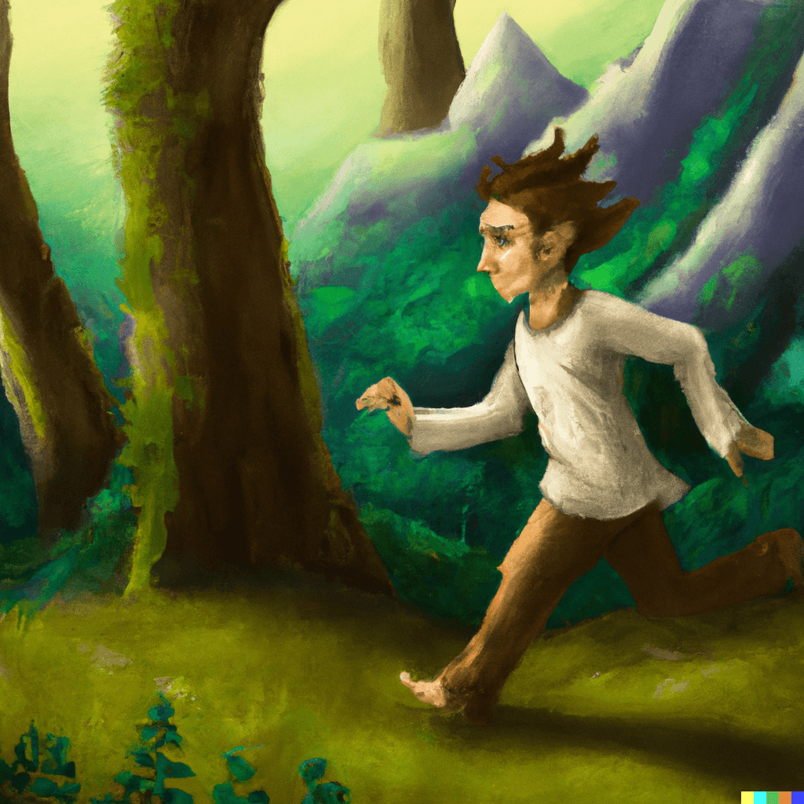
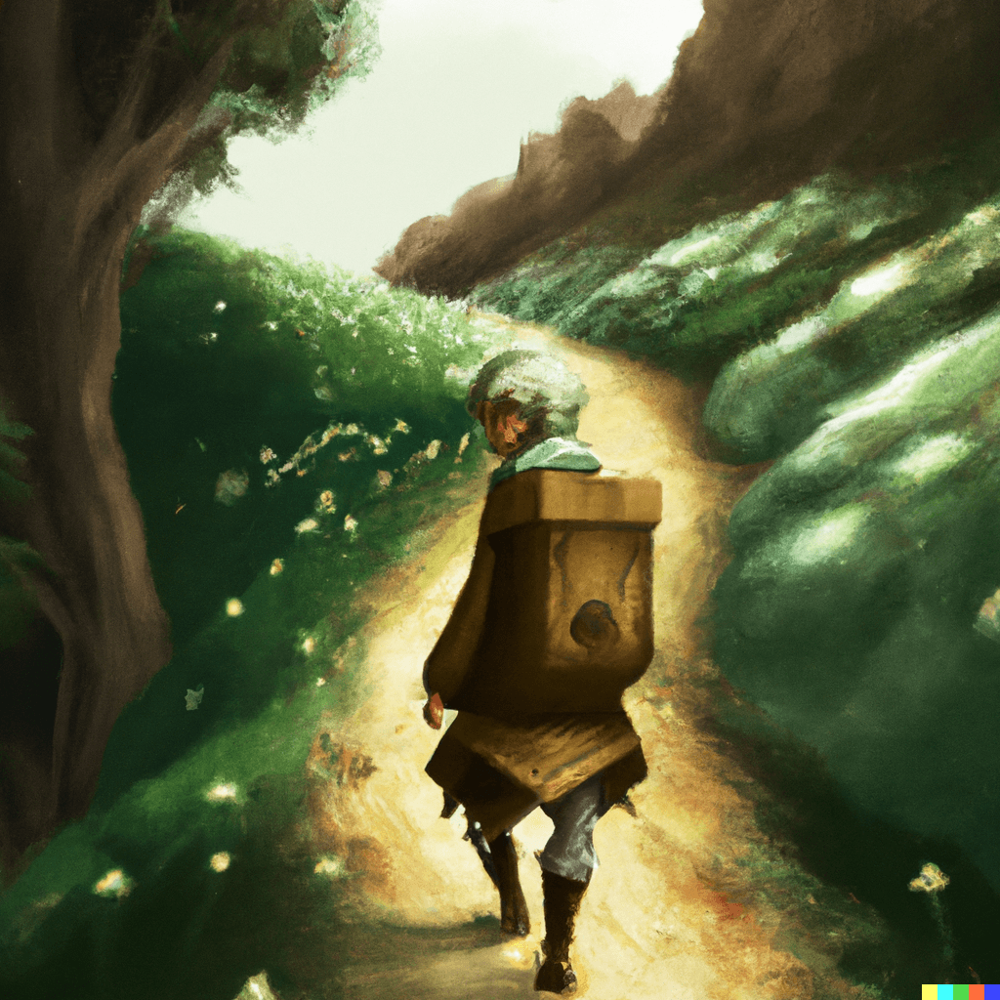
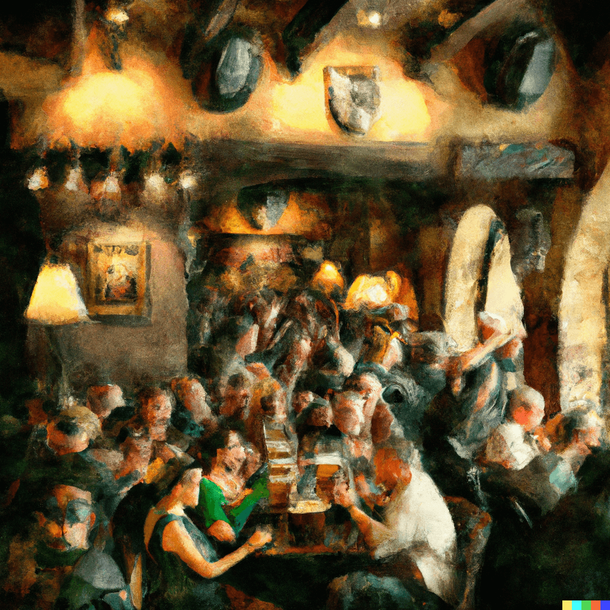
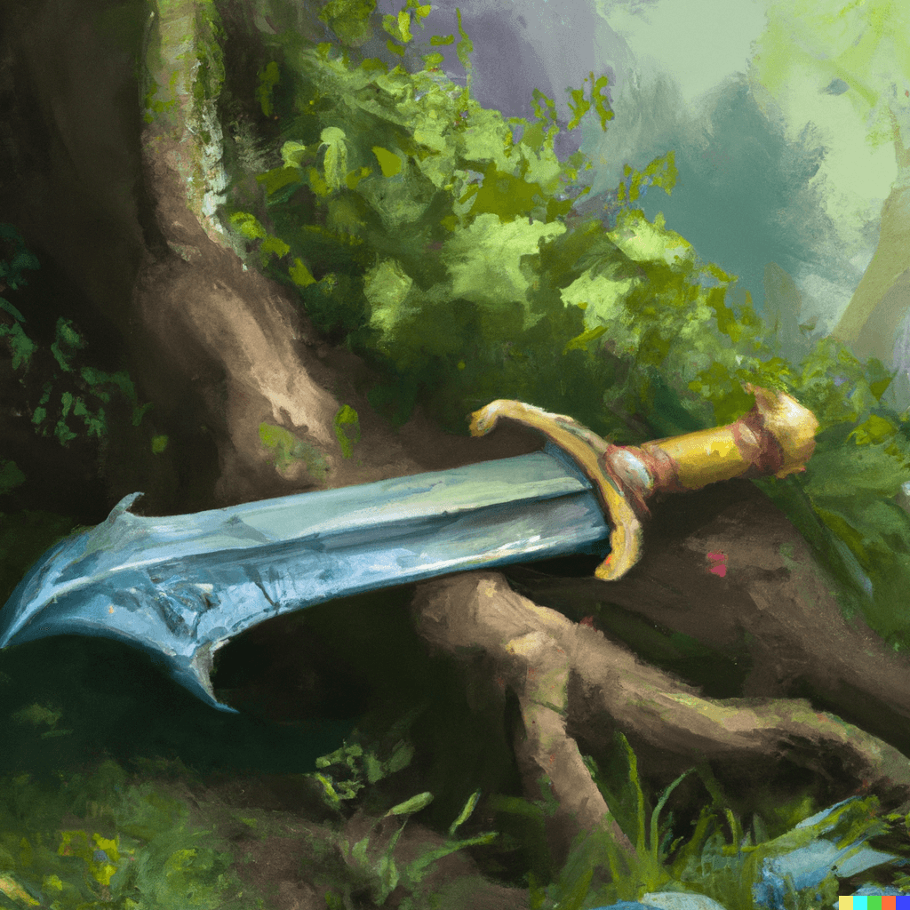

<h1>Shaolin: Waking of the Legend</h1>
<h3>Book 1 of the <strong>Elvanar Chronicles</strong></h3>
 

  

## Table of contents

- [About the author](#about-the-author)
- [Chapter 1](#chapter-1)
- [Chapter 2](#chapter-2)
- [Chapter 3](#chapter-3)
- [Chapter 4](#chapter-4)
- [Chapter 5](#chapter-5)

## About the author

Beep boop. To add.

## Chapter 1

In the remote and barren lands of the north, a poor teenage farm boy named Shaolin struggled to survive. Born of mixed heritage to a father he barely knew and a mother shrouded in mystery, Shaolin was an outsider in a harsh and unforgiving world. Raised on a small farm a day's walk from the nearest town, he spent his youth exploring the dark and tangled forests that surrounded his home. In the summers, he would roam the woods for hours on end, stalking rabbits and game with his trusty bow. He came to know every inch of the forest, from the trickling streams where he drank to the towering trees that reached towards the sky.

As he grew older, Shaolin began to sense a deep connection to the forest, as if it were a living, breathing entity. He spent his evenings sitting by the fire, lost in thought as he gazed into the flames and pondered the secrets of the wild. Though he was poor and alone, Shaolin found solace and beauty in the embrace of the forest, and he knew that it would always be his home.

Shaolin sat by the fire, slowly honing the sharp tips of his arrows as he listened to the sounds of the forest. He had been stalking a boar for the last two days, and he could feel the tension building within him. He knew that the boar was close, and he was determined to bring it down. As he sat by the fire, he began to hear a rustle in the bushes in the distance. At first, he dismissed it as just another animal moving through the underbrush, but the rustle grew louder and more persistent. Shaolin's elven ears began to point, and he could feel his senses coming alive. He was on edge, gazing intently into the forest in the direction of the sound, unsure of what was coming.

The rustling grew louder, and Shaolin could hear the crunch of leaves and twigs underfoot. He reached for his bow, his heart racing as he tried to make out the source of the noise. Was it the boar, finally revealing itself? Or was it something else, something more dangerous? Shaolin's hand shook as he nocked an arrow, his eyes scanning the darkness for any sign of movement.

Suddenly, a massive boar burst from the underbrush, charging towards Shaolin with a fierce snarl. Shaolin let his arrow fly, and it struck the boar with a satisfying thunk. The boar stumbled, then fell to the ground with a heavy thud. Shaolin let out a triumphant cry, his heart pounding with adrenaline and excitement. He had finally brought down the elusive boar, and he knew that he would be able to feed his family for weeks with the meat.

As he approached the boar, he could see that it was still breathing. He drew his knife, ready to deliver the final blow, but something stopped him. The boar looked up at him with fear and pain in its eyes, and Shaolin felt a sudden pang of guilt and pity. He couldn't bring himself to kill the beast, not like this. Instead, he mercifully ended its suffering with a quick and painless blow, then set about skinning and butchering the boar for its meat.

As he worked, Shaolin couldn't help but think about the journey that had brought him to this moment. He had always known that he was different, with his elven blood and his human father, but he had never felt more alive than he did in the forest. It was his home, his sanctuary, and he knew that he would always return to it, no matter what obstacles lay in his path.

As Shaolin worked on skinning and butchering the boar, he couldn't shake the feeling that he was being watched. The hairs on the back of his neck started to tingle, and he could sense a presence lurking in the shadows. He stopped what he was doing and listened carefully, but he couldn't hear anything out of the ordinary. He looked around the forest, scanning the trees and the underbrush for any sign of movement, but there was nothing there. Despite his efforts, the feeling persisted, growing stronger with each passing moment.

Shaolin tried to focus on his work, but it was difficult to concentrate with the sense of being watched hanging over him. He couldn't shake the feeling that someone, or something, was out there, watching his every move. He tried to reassure himself that it was just his imagination, but the feeling only grew stronger.

The feeling made Shaolin uneasy, and he couldn't shake the vague recollection of experiencing something similar when he was a child. He tried to remember when it had happened, but the memory eluded him. All he knew was that it had left him feeling just as uneasy and on edge as he did now.

As he settled back down next to the fire, trying to fall asleep, Shaolin couldn't ignore the feeling of being watched. He tossed and turned, his mind racing with unease. He knew that he would have to be extra vigilant in the days to come, lest he become the prey of whatever was stalking him in the shadows.

## Chapter 2

As the first rays of sunlight peeked over the horizon, Shaolin stirred from his slumber. He thought he had heard something in the night, but he wasn't sure if it was just a dream or if it was real. He had a vague recollection of the sound, but it was just out of reach, like a word on the tip of his tongue. As he woke, the feeling faded, and he was left with a sense of unease.

Shaolin quickly packed up his gear, carefully stowing the boar meat in his pack. He set off towards home, his senses on high alert. As he walked, the feeling of unease began to dissipate, replaced by a sense of anticipation. He was looking forward to seeing his father, and sharing the news of his successful hunt.

The morning was crisp and clear, and Shaolin could hear the birds singing in the trees as he walked. He passed the family goats and chickens, noting that the goats were further out than usual. His father never let them roam so far from home unattended, and Shaolin couldn't shake the feeling that something was amiss. As he approached the farmhouse, he noticed that the door was slightly ajar, which only added to his sense of unease.

Shaolin cautiously pushed the door open, calling out for his father. There was no response, and the house was eerily quiet. Shaolin's heart began to race as he searched the house, growing more and more worried with each passing moment. Where was his father, and what had happened while he was out in the forest?

He searched the house from top to bottom, but there was no sign of his father. Everything seemed to be in its place, but there was a strange feeling of emptiness that hung in the air. Shaolin tried to shake off the feeling of dread that was growing within him, but he couldn't shake the sense that something terrible had happened.

As he stepped outside, Shaolin saw a trail of footprints leading away from the house. They looked like his father's, but the stride was longer than usual, almost as though he was running. Shaolin's heart raced as he followed the footprints, fear and confusion coursing through his veins. Where was his father, and what had happened?

The footprints led Shaolin back into the forest, and he could feel his sense of unease growing with each step. The forest was eerily quiet, and there was no sign of his father. Shaolin called out for him, but there was no response. He continued to follow the footprints, his heart pounding in his chest.

After what felt like an eternity, the footprints led Shaolin to a small enclave in the forest. The footprints disappeared, and Shaolin was at a loss. He searched the area for any sign of his father, but there was nothing there. It was as though he had simply vanished into thin air.

Shaolin's mind was awhirl with fear and confusion. What could have happened to his father? Had he been taken, or had he simply wandered off? Shaolin didn't know, but he knew that he had to find out. He searched the area for any clues, but there was nothing there. It was as though his father had simply disappeared without a trace.

As the realization of his situation hit him, Shaolin's fear and confusion turned to grief and despair. He was alone, and he had no idea what had happened to his father. He didn't know if he would ever see him again, and the thought was almost too much to bear. Shaolin fought back tears, determined to stay strong. He didn't know what to do, or where to turn. He was alone, and he had no one to help him. All he could do was hope that his father would return, and that he would be safe.

--

Shaolin forced himself to his feet, unsure of how much time he had spent on the ground in grief. The sun was beginning to set, casting a golden glow over the forest. Shaolin didn't know what to do or where to turn, but he knew that he couldn't stay in the forest forever.

He resolved to head back to the farm to see if his father had returned, and if not, to travel into town the following morning to ask for help. He didn't know what he would find when he got back to the farm, but he knew that he had to try. He took a deep breath and began the long journey back home.

The walk back to the farm was long and difficult, and Shaolin's mind was consumed with worry and fear. He couldn't shake the feeling that something terrible had happened to his father, and the thought made his heart heavy. As the darkness closed in around him, he quickened his pace, eager to get back to the safety of the farm.

When he finally reached the farm, he was disappointed to find that there was still no sign of his father. Shaolin searched the house and the surrounding area, but there was no trace of him. He was exhausted from the day's events, and he knew that he needed to get some rest.

Shaolin headed to bed, his mind racing with thoughts of his father and the uneasy feeling that it was somehow linked to the feeling of being watched he had had in the forest the evening prior. As he drifted off to sleep, he couldn't shake the feeling that something sinister was at work, and that he was at the center of it. He didn't know what the future held, but he knew that he would do whatever it took to find his father and bring him home safely.

## Chapter 3

Shaolin woke up to the sound of roosters crowing, a reminder that another day was beginning. For a moment, he was able to forget the events of the previous day, but then the reality of his father's disappearance came rushing back to him. He knew that he had to do something, but he didn't know where to start.

Shaolin got out of bed and began to get dressed. He packed a small bag with some food and supplies, thinking about the long journey ahead of him. He knew that he needed to go into town and ask for help, but he was unsure of what he would find there. He tried to push aside his worries and focus on the task at hand.

As he walked through the house, he couldn't shake the feeling that something was off. The front door was slightly ajar, and Shaolin couldn't remember if he had closed it before heading to bed the night before. The goats were still wandering freely outside, and Shaolin realized that he had forgotten to tend to them the previous day. It was as if his father had just vanished into thin air, leaving no trace behind.

Shaolin tended to the goats and chickens, promising to himself that he would enlist the help of the townspeople to look after the farm in his absence. He wasn't sure if he would ever return to the farm, but he knew that he had to try. He took one last look around the house, and then set off on the long walk to town.

The walk to town was long and difficult, and Shaolin's mind was consumed with worry and fear. He couldn't shake the feeling that something terrible had happened to his father, and the thought made his heart heavy. As he walked, he couldn't help but think about all the things he would never be able to do with his father again, like going hunting or exploring the forest together.

But Shaolin was determined to keep going. He knew that he had to find out what had happened to his father, and he was willing to do whatever it took to bring him home safely. He pushed aside his grief and focused on the task at hand, determined to find answers in town.

After a couple of hours of walking, Shaolin began to approach the farm of his nearest neighbor, Gaelvinor. He knew that Gaelvinor was a good man, and he was hoping that he would be able to help him in his search for his father.

As Shaolin walked, he couldn't help but reflect on the situation. He couldn't imagine why his father would have left the farm without telling him. But, no matter how small the chances were of Gaelvinor knowing anything, Shaolin knew that he had to ask.

When Shaolin arrived at Gaelvinor's farm, he saw that Gaelvinor was out in the fields, tending to his crops. Shaolin called out to him, and Gaelvinor turned to see who was there. When he saw Shaolin, his face broke into a concerned expression.

"Shaolin, my boy! It's good to see you. What brings you out here?" Gaelvinor asked, walking over to greet him.

Shaolin explained the situation to Gaelvinor, telling him about his father's disappearance and his search for answers. Gaelvinor listened carefully, his face growing serious.

"I'm so sorry to hear about your father, Shaolin. I haven't seen or heard from him since the last time he came over to trade some of your farm's goods for some of mine. But I've noticed a few odd things happening on my farm lately," Gaelvinor said, his brow furrowing in concern. "Two of my goats have gone missing, and a few of my chickens have been killed. It's not foxes or wolves, I'm not sure what it is.

Gaelvinor's face grew even more serious as he continued to speak. "The way the goats and chickens were killed... it was gruesome. It looked like they had been ripped apart, almost like they had been attacked by some kind of wild animal. But I've never seen anything like it before, and I don't know what to do. I'm scared, Shaolin. I don't know what's happening on my farm, and I don't know if it's connected to your father's disappearance."

Shaolin listened to Gaelvinor's words, his heart heavy with concern. He couldn't shake the feeling that something terrible was happening on the farms, and he knew that he had to do something to stop it.

"Thank you for telling me this, Gaelvinor. I'll do my best to figure out what's going on, and I'll do whatever it takes to keep our farms safe," Shaolin said, his determination clear in his voice.

Gaelvinor nodded, grateful for Shaolin's words. "I'm afraid to leave my farm, Shaolin. I don't know what to do," he said, his voice shaking with fear.

Shaolin could see the fear in Gaelvinor's eyes, and he knew that he had to reassure him. "I'll figure it out, Gaelvinor. In the meantime, I'll leave my animals with you. You don't have to worry."

Gaelvinor agreed to take care of Shaolin's animals, and Shaolin set off back towards town with a renewed resolve, determined to find out what was happening and put a stop to it.

## Chapter 4

Shaolin had been walking for hours, his feet heavy and his body exhausted. He had been pushing himself hard, driven by the determination to find out what had happened to his father. As he crested the final hill, he saw the town of Avondale in the distance, its streets illuminated by lanterns.

He could hear the sounds of revelry even from this distance, and he knew that the town would be in the midst of the end of harvest celebrations. People would be dancing and singing, celebrating the end of another successful growing season.

Shaolin hesitated for a moment, unsure if he wanted to interrupt the celebrations. But he knew that he needed to find out what had happened to his father, and he didn't have time to wait. He took a deep breath and continued towards the town, his heart heavy with worry.

As he entered the town, the sounds of revelry grew louder. He could hear laughter and music coming from the tavern, and he knew that the town would be in the midst of the end of harvest celebrations. The streets were lined with lanterns, casting a warm glow over the cobblestones.

Shaolin pushed open the door to the tavern, stepping into the warm, noisy space. He was immediately hit by the smell of ale and roasted meat, and he could hear the sounds of laughter and music all around him. He felt out of place, unsure of how to proceed.

He scanned the crowd, looking for someone he knew. He spotted a few familiar faces, but most of the townspeople were strangers to him. He hesitated, unsure if he should approach anyone. He didn't want to interrupt the celebrations, but he knew that he needed information.

He made his way over to the bar, where the tavernkeeper was busy serving ale to the revelers. Shaolin waited patiently, trying to catch the tavernkeeper's eye. When he finally succeeded, he asked if he knew anything about his father's disappearance. The tavernkeeper shook his head, and Shaolin's heart sank.

He turned to leave, feeling defeated. But as he was about to walk out the door, he felt a hand on his shoulder. He turned to see a familiar face - it was old man O'Neil, a farmer from a few miles away. He looked worried, and he beckoned for Shaolin to follow him.

Shaolin followed the old man through the crowded tavern, dodging revelers as they made their way to a small table in the corner. The old man gestured for Shaolin to sit, and he did so, his heart pounding with anticipation.

"I'm sorry to hear about your father, lad," the old man said, his voice grave. "I've heard some things that might explain what's been happening around here."

Shaolin's heart skipped a beat. "What do you mean?" he asked, his voice barely above a whisper.

"There's been some strange things happening on the farms around here," the old man said, leaning in closer. "Animals have been disappearing, and some have been found dead. And there have been rumors of strange creatures in the forest."

Shaolin felt a chill run down his spine. "What kind of creatures?" he asked, his voice shaking.

The old man hesitated, his eyes darting around the room. "Some say they're elves," he said in a low voice. "But I don't know if I believe that. All I know is that something is out there, and it's not friendly."

Shaolin's mind was racing. Could his mother, the elf he never knew, have something to do with his father's disappearance?

Shaolin sat in stunned silence, his mind racing with the old man's words. Elves in the forest? It was hard to believe, but something in the old man's eyes told Shaolin that he was serious.

"How do you know all of this?" Shaolin asked, his voice barely above a whisper.

The old man, O'Neal, leaned in closer. "I've been hearing things," he said in a low voice. "People in the town have been talking. And I've seen things myself, out in the forest."

As Shaolin listened, he couldn't shake the eerie feeling he had experienced in the forest the day before. Could it be connected to his father's disappearance? He didn't know, but he knew that he had to find out.

"I need to go to the forest," Shaolin said, his voice shaking. "I think the answer to my father's disappearance might be there."

O'Neal nodded, his eyes full of sympathy. "Be careful, lad," he said. "The forest is a dangerous place, and these creatures are not to be trifled with."

Shaolin stood up from the table, his mind made up. He was going to face the dangers of the forest alone, no matter the cost. But as he turned to leave the tavern, he caught the eye of a girl across the room. It was Elora, a girl he had known since childhood.

Shaolin's heart skipped a beat as he saw Elora across the tavern. She was the daughter of one of the town's wealthiest merchants, and despite their different backgrounds, Shaolin had always been drawn to her. They had met when they were both children, and although they didn't grow up together on the farm, Shaolin always looked forward to coming into town to sell his father's crops to see her. Elora had always been mysterious, never divulging information about her parentage, but Shaolin couldn't help the special connection he felt to her.

As he made his way over to her table, he could see the concern in her eyes. She could tell he was distraught, and she beckoned for him to follow her outside.

Shaolin follows Elora outside, feeling a sense of relief wash over him. As they walk, she turns to him, her eyes full of concern. "What happened?" she asks. Shaolin takes a deep breath, unsure of where to start. He explains to her about the feeling of being watched in the forest, and about his father's disappearance. Elora listens intently, her hand on his arm in a comforting gesture. "We'll figure it out together," she assures him, and Shaolin can't help but feel a spark of hope in his chest.

"I'm so tired," Shaolin said, his voice barely above a whisper. "I don't know what's happening. My father is missing and I don't know where to start looking."

"Come on," Elora said, taking Shaolin's hand. "Let's go back to my parents' house. You can sleep there tonight, and we'll figure out what to do in the morning."

Shaolin nodded, grateful for her offer. He didn't know what he would do without her. She had always been there for him, even when they were just children.

As they walked, Shaolin couldn't shake the feeling that something was watching him. He looked around, but he couldn't see anything in the darkness.

"Are you okay?" Elora asked, sensing his unease.

"I just have this feeling like someone is watching me," Shaolin said, his voice barely above a whisper.

"It's probably just your imagination," Elora said, trying to reassure him. "Let's just focus on finding your father."

Shaolin nodded, grateful for her words. He knew she was right. He needed to focus on finding his father, and everything else could wait.

## Chapter 5

Shaolin stood in the clearing in the forest, his eyes scanning the trees and underbrush as he tried to put into words the eerie feeling that had come over him the day before. He could still remember the feeling of being watched, of his elvish ears straining to hear the rustle of leaves or snap of a twig that had never come.

"It was like... like someone was there, just out of sight," Shaolin explained to Elora, who stood beside him with a concerned look on her face. "I couldn't see or hear anything, but I just couldn't shake the feeling."

Elora nodded, her eyes scanning the forest as well. "I know what you mean," she said softly. "I've felt it too, sometimes. Like there's something out there, watching us."

Shaolin nodded, his mind racing with possibilities. Could his mother's elvish blood have anything to do with it? Or was it just the forest playing tricks on them?

They move deeper into the forest, following the direction of the feeling. As they walk, Shaolin starts to notice that the trees and plants around them look different - they're older, more overgrown. It's as though they've stumbled into an untouched part of the forest. They continue on, unsure of what they'll find but with a growing sense of excitement.

As Shaolin and Elora made their way deeper into the forest, the eerie feeling that Shaolin had experienced two days prior returned. The hairs on the back of his neck stood on end, and he could hear his own heart pounding in his chest. Despite his fear, he pushed on, determined to find out what was happening and if it had anything to do with his father's disappearance.

Elora, too, could sense something was off. She kept close to Shaolin, her hand on the hilt of her sword as they moved cautiously through the dense underbrush, until they emerged in a clearing.

In the clearing, Shaolin and Elora find evidence of a struggle. Twigs are broken and leaves are crushed underfoot. There are dark stains on some of the foliage, and Shaolin cautiously approaches to investigate. As he gets closer, he can see that the stains are blood. He looks around, trying to make sense of the scene before him. It's clear that something violent happened here, but he can't tell who was involved or what they were fighting over.

Elora comes up beside him, her face pale. She points to a patch of bushes on the far side of the clearing. "There's something hidden in there," she says. Shaolin moves closer, pushing aside the leaves to reveal a small, ancient-looking dagger. It's made of a dark metal, and the handle is intricately carved. He picks it up, turning it over in his hands. It's clearly valuable, but he has no idea who it belongs to or how it ended up in the forest.

Shaolin looks around the clearing again, trying to piece together what happened here. He can't shake the feeling that this has something to do with his father's disappearance, but he can't be sure. Elora puts a hand on his shoulder, and he looks up at her. "We need to go back to town," she says. "We need to tell someone about this."

Shaolin nods, still feeling uneasy. He knows that they can't keep this a secret. Whatever happened here, it's clear that someone is in danger. He hopes that by going to the townspeople, they can figure out what's going on and put a stop to it before anyone else gets hurt.
