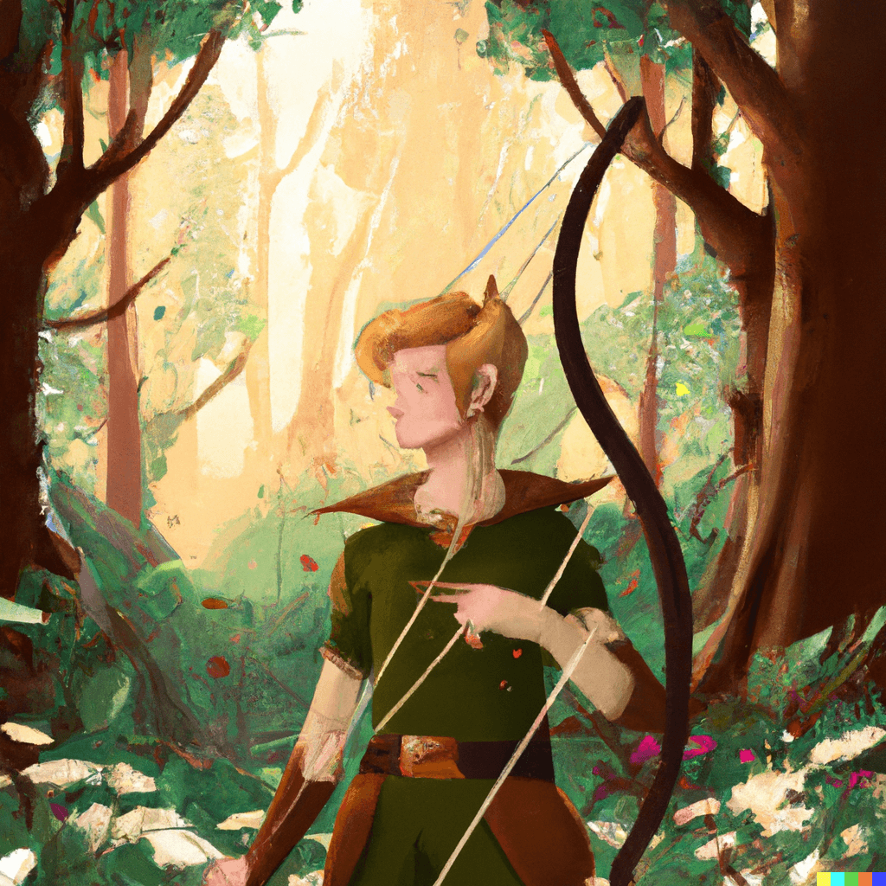
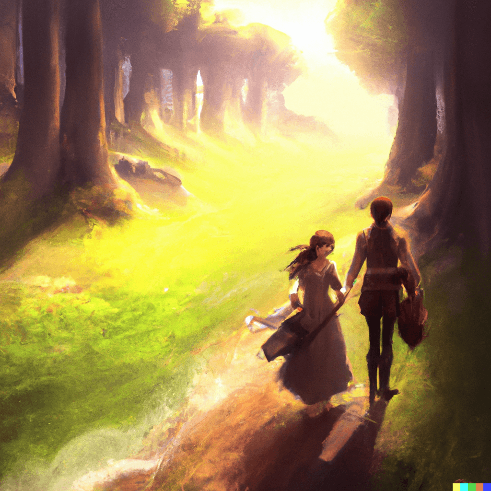
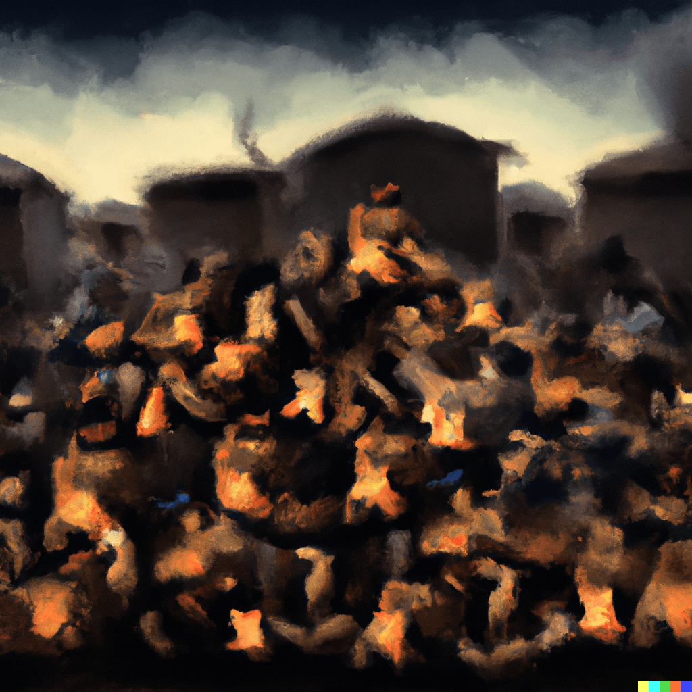

<h1>Shaolin: Waking of the Legend</h1>
<h3>Book 1 of the <strong>Elvanar Chronicles</strong></h3>
 

  

## About the author

Beep boop. To add.

## Chapter 1: The Awakening

Far beyond the realms of men, in a world untouched by the passage of time, the Elvanar Mountains stood tall and majestic. The peaks pierced the heavens, while ancient forests spread beneath their shadows. The roots of these trees burrowed deep into the earth, hiding the secrets of the land. In this enchanted world, the tale of the Elvanar Chronicles began.

A young boy named Jareth, no older than fourteen, lived in the small village of Tarnwood, nestled in the heart of the mountains. He was a kind-hearted boy with bright, inquisitive eyes and a knack for finding trouble. He led a simple life, learning the ways of the land and the lore of his people from his father, a skilled hunter and tracker.

One fateful day, as Jareth roamed through the forest in search of adventure, he stumbled upon a wounded creature unlike any he had ever seen before. It was a magnificent beast with sleek, silver-scaled skin and piercing blue eyes that seemed to see straight into his soul. The creature's wings were tattered and torn, evidence of a great battle fought.

Despite his fear, Jareth's compassion overcame him, and he approached the wounded creature, determined to help it. As he drew closer, he could feel a strange connection forming between them, as if they were two pieces of a puzzle coming together.

In the days that followed, Jareth nursed the creature back to health, and their bond grew stronger. He discovered that the creature was a mythical dragon called Shaolin, the last of his kind, who had been engaged in a fierce battle with a dark and powerful force that threatened the balance of their world.

Shaolin sensed that Jareth was no ordinary boy, and that he possessed a great and untapped power. He decided to take Jareth under his wing, quite literally, and teach him the ancient ways of the dragon riders - an order of warriors who had once defended the Elvanar Mountains, before they were nearly wiped out by the same darkness that now threatened to return.

Jareth's training began in earnest, and under Shaolin's tutelage, he learned to harness his latent abilities. He learned to wield magic, to speak with the creatures of the forest, and to soar through the skies with grace and speed. As his power and skill grew, so too did the legend of Jareth, the young dragon rider.

But the return of the darkness loomed ever nearer, and Jareth knew that he would soon be called upon to face a challenge that would decide the fate of his world. The Elvanar Chronicles had just begun, and Jareth was destined to play a pivotal role in the epic story that would unfold.

## Chapter 2: The First Trial

In the heart of the Elvanar Mountains, the ancient city of Elvandar lay hidden, a testament to the wisdom and skill of those who had come before. Shaolin knew that to fully prepare Jareth for the trials ahead, they would need the guidance of the ancient texts and artifacts stored within the city. As the sun dipped beneath the horizon, they set off on a treacherous journey, guided only by the stars above and their unyielding determination.

As they ventured further from Tarnwood, the terrain grew more perilous, and they faced challenges that tested their strength and bond. Jareth's skills were honed by the countless obstacles they overcame, and his connection with Shaolin grew deeper than ever.

Finally, after days of travel, they arrived at the gates of Elvandar. The ancient city welcomed them, its stone and crystal structures seemingly alive with a quiet, watchful energy. Jareth marveled at the beauty of the city, feeling the weight of history and expectation settle on his shoulders.

They sought out the city's Great Library, a place rumored to hold the collective knowledge of the Elvanar people. Here, they delved into ancient texts, learning the secrets of the dragon riders and the magic that coursed through Jareth's veins. They discovered the story of the First Trial, a test that each dragon rider had faced to prove their worth and prepare them for the battles ahead.

The First Trial required Jareth to venture into the Cavern of Whispers, a place of darkness and illusion. Shaolin could not accompany him, for the test was designed to challenge a rider's inner strength and resilience. With trepidation, Jareth entered the cavern, armed only with his wits and the lessons he had learned from his mentor.

Within the inky blackness, the Cavern of Whispers tested Jareth's resolve, forcing him to confront his fears and insecurities. He battled against illusions of monstrous beasts and twisted versions of his loved ones, each more harrowing than the last. Through sheer determination and the power of his newfound abilities, Jareth emerged from the cavern victorious, having conquered his fears and proven himself worthy of the mantle of a dragon rider.

As Jareth and Shaolin left Elvandar, they knew their journey was far from over. The First Trial was but one step on the path to face the encroaching darkness. With newfound strength and purpose, they returned to Tarnwood, ready to rally their people and prepare for the battles that lay ahead in the Elvanar Chronicles.

## Chapter 3

Jareth and Shaolin returned to Tarnwood, their spirits buoyed by the completion of the First Trial. Word of Jareth's exploits had already spread throughout the village, and the people greeted him with awe and admiration. They knew that he was their last hope against the gathering darkness, and the fate of their world rested on his young shoulders.

Shaolin urged Jareth to share the knowledge he had gained in Elvandar with the people of Tarnwood. Together, they trained the villagers in the arts of combat and magic, forging a formidable force to stand against the encroaching evil. As the weeks passed, the bond between Jareth and Shaolin continued to deepen, and their combined strength grew ever more powerful.

The day came when the skies darkened, and the shadows grew long over the Elvanar Mountains. The darkness had finally arrived, its malignant forces seeping into the very fabric of the world. At its helm was a sinister figure, a sorcerer of immense power, whose twisted heart sought only destruction and chaos.

As the forces of darkness descended upon Tarnwood, the village's defenders stood strong, ready to protect their home at any cost. Jareth, now a seasoned dragon rider, led them fearlessly, the lessons of his mentor and the power of their bond guiding him through the fray. The battle raged, a cacophony of steel and magic that echoed throughout the mountains.

In the heart of the conflict, Jareth and Shaolin faced the sorcerer, their combined strength a shining beacon against the darkness. The battle was fierce, with the sorcerer's malevolent power threatening to overwhelm even the might of a dragon rider. But Jareth's spirit was unyielding, and the bond between him and Shaolin was unbreakable.

In a climactic moment, Jareth summoned the full extent of his power and struck a decisive blow against the sorcerer, casting him back into the shadows from whence he came. The darkness receded, its vile tendrils retreating from the Elvanar Mountains, leaving the world to heal and rebuild.

The people of Tarnwood rejoiced, their home saved from the clutches of evil. But Jareth knew that the sorcerer's defeat was but a temporary reprieve, and the struggle against the darkness would continue. For now, though, there was hope, and the legend of Jareth, the dragon rider, would echo through the ages as a symbol of courage and resilience in the face of adversity.

As the Elvanar Chronicles continued to unfold, Jareth and Shaolin would face countless challenges and adventures, their bond and bravery a beacon of hope in a world on the precipice of change.

## Chapter 4: The Legacy Uncovered

The defeat of the sorcerer and the temporary reprieve from darkness allowed the people of Tarnwood to rebuild their lives. Jareth and Shaolin, now celebrated as heroes, continued their quest to unlock the secrets of the dragon riders and prepare for the inevitable return of the darkness.

Whispers of an ancient prophecy, long believed to be a mere legend, began to circulate among the people. It told of a powerful artifact, hidden deep within the Elvanar Mountains, that could unite the world against the darkness and bring about a new age of peace and prosperity. Jareth and Shaolin felt compelled to seek out the truth behind this prophecy, knowing that its discovery could change the course of history.

Their journey led them to the farthest reaches of the Elvanar Mountains, where they encountered strange and wondrous creatures that had never before been seen by human eyes. They encountered trials and tribulations that tested their courage and resolve, but through it all, their bond remained unbroken.

As they delved deeper into the mountains, they discovered the entrance to a hidden temple, its ancient walls adorned with intricate carvings depicting the legend of the artifact. Inside, they found a vast chamber illuminated by a single ray of sunlight, at its center a pedestal holding a magnificent crystal. Jareth could feel the power emanating from the crystal, its energy resonating with his own.

Shaolin revealed that the crystal was the Heart of Elvanar, a relic of immense power that had been lost to the ages. The Heart had the ability to amplify the powers of the dragon riders, and when united with the people of the world, it could create an unstoppable force against the darkness.

The discovery of the Heart of Elvanar marked a new chapter in the Elvanar Chronicles. Jareth and Shaolin embarked on a journey to unite the people of the land and teach them the ways of the dragon riders. They traveled from village to village, inspiring hope and gathering followers to join them in their quest to vanquish the darkness once and for all.

As they journeyed, Jareth's power grew, fueled by the Heart of Elvanar and the unwavering faith of those who followed him. His legend spread far and wide, and with each passing day, the world grew closer to the unity and strength needed to face the coming storm.

The Elvanar Chronicles continued to unfold, as Jareth, Shaolin, and their growing band of followers prepared for the greatest battle their world had ever known. United by hope and bound by fate, they would stand against the darkness and fight for the future of their world.

## Chapter 5 - The Alliance Forged

As the legend of Jareth and Shaolin spread across the land, their journey to unite the people took them to the far corners of the world. They sought the wisdom and support of the great kingdoms, each with its own unique culture and strengths. The Heart of Elvanar, a beacon of hope and unity, guided them on their path.

In the kingdom of Istara, they found skilled archers and mages, versed in the arts of magic and defense. The queen of Istara, a wise and compassionate ruler, recognized the importance of their quest and pledged her support, sending her finest warriors to join their ranks.

To the east, in the arid lands of Qaradan, Jareth and Shaolin forged an alliance with the nomadic tribes that roamed the deserts. The tribespeople, masters of survival and stealth, eagerly joined the cause, eager to protect their homes and the world beyond from the encroaching darkness.

Even the reclusive elves of the Moonlit Glade, long distrustful of humans, were swayed by Jareth's sincerity and conviction. The elven archers and enchanters, renowned for their grace and mastery of ancient magics, added their formidable skills to the growing alliance.

Jareth and Shaolin continued their journey, forging alliances with the dwarves of the Ironforge Mountains, the seafaring folk of the Azure Coast, and many more. With each new ally, the strength of their bond and their cause grew, and the world drew ever closer to standing as one against the darkness.

As the alliance grew, so too did the power of the Heart of Elvanar. Jareth could feel its energy coursing through him, weaving a connection between him and each member of their vast and diverse army. They were united in purpose, their hearts beating as one, a force to be reckoned with.

The time came for Jareth, Shaolin, and their newfound allies to gather in Tarnwood, preparing for the final confrontation with the darkness. The village, once a simple and unassuming home, had become the heart of a great and powerful alliance, its people standing shoulder to shoulder with warriors, mages, and creatures from every corner of the world.

As the skies above the Elvanar Mountains began to darken once more, signaling the imminent return of the sorcerer and his malevolent forces, the alliance readied themselves for battle. The Elvanar Chronicles had reached a critical juncture, as the fate of their world hung in the balance. Together, bound by courage, hope, and the Heart of Elvanar, they would face the darkness and fight to protect all they held dear.

## Chapter 6: The Battle of Ages

As the darkness descended upon the Elvanar Mountains, casting its ominous shadow over Tarnwood and beyond, the alliance stood resolute, prepared to face the sorcerer and his malevolent forces. The air was thick with anticipation and the promise of the battle to come, a conflict that would shape the destiny of their world.

Jareth, astride Shaolin, surveyed the gathered forces, his heart swelling with pride and determination. They were an army forged from the fires of unity and hope, bound by the power of the Heart of Elvanar. He knew that the road ahead would be fraught with danger and loss, but he believed in the strength and resilience of their alliance.

The first wave of the sorcerer's forces crashed against their defenses, a horde of twisted creatures born from the depths of darkness. The alliance met them with a ferocity born of desperation, their swords, arrows, and spells cutting through the enemy ranks.

As the battle raged, Jareth and Shaolin cut through the skies, their bond and the power of the Heart of Elvanar allowing them to unleash torrents of flame and bolts of arcane energy upon their foes. They were a beacon of hope and strength, inspiring their allies to fight on, even as the tide of darkness threatened to overwhelm them.

The sorcerer, sensing the power and unity that Jareth and the alliance wielded, emerged from the heart of the darkness, his twisted visage a testament to the corruption that had consumed him. His eyes locked onto Jareth, a malevolent fire burning within them, and he knew that their final confrontation was at hand.

The battle reached a fever pitch as Jareth and Shaolin engaged the sorcerer in a clash of power and will. Their forces battled valiantly below, holding the line against the relentless tide of darkness, but the outcome of the conflict would be decided by the young dragon rider and his mentor.

With every blow struck and spell cast, the power of the Heart of Elvanar surged, its energy coursing through Jareth and Shaolin, and reaching out to every member of the alliance. They could feel their strength and unity amplified, their hearts beating as one, their spirits unyielding in the face of adversity.

In a final, climactic moment, Jareth and Shaolin unleashed the full might of the Heart of Elvanar, a brilliant wave of energy that washed over the battlefield, driving back the darkness and striking at the very core of the sorcerer's power. The force of the blast was overwhelming, and as it struck the sorcerer, his twisted form crumbled, consumed by the light of unity and hope.

As the darkness retreated, the alliance stood victorious, their world saved from the brink of destruction. They had faced the greatest battle of their age, and through their unity and the power of the Heart of Elvanar, they had triumphed.

The Elvanar Chronicles had reached a triumphant crescendo, but the story was far from over. Jareth and Shaolin, their bond stronger than ever, would continue their journey through a world forever changed, guiding the people of the land towards a brighter, more hopeful future.

## Chapter 7: A New Dawn

In the aftermath of the great battle, the world began to heal, the wounds inflicted by the darkness slowly mending under the watchful eyes of Jareth, Shaolin, and their alliance. The victory against the sorcerer had united the people of the land, and the power of the Heart of Elvanar continued to bind them together, fostering a newfound era of peace and cooperation.

Tarnwood, once a humble village, had become the heart of this new world, a symbol of unity and resilience. Jareth and Shaolin, hailed as heroes, dedicated themselves to guiding the people of the land in the rebuilding process, using their wisdom and strength to ensure that the hard-won peace would endure.

Across the world, the kingdoms and peoples that had once been divided by mistrust and conflict now worked together, their shared experience in the battle against the darkness serving as the foundation for a new era of collaboration and understanding. Trade and knowledge flowed between the lands, and the once-isolated Moonlit Glade, Ironforge Mountains, and Azure Coast now welcomed travelers and emissaries with open arms.

In the years that followed, Jareth and Shaolin continued to explore the world, seeking out lost knowledge and forgotten secrets that could further strengthen the bond between the people of the land. Their journey led them to ancient ruins, hidden cities, and uncharted realms, each adventure adding another chapter to the ongoing Elvanar Chronicles.

As the world flourished under the guidance of Jareth and Shaolin, new generations of dragon riders began to emerge, each one guided by the teachings of the Heart of Elvanar and the wisdom of their mentors. These new riders took up the mantle of guardians, ensuring that the lessons of unity and hope would never be forgotten.

Though the darkness had been vanquished, Jareth and Shaolin knew that the world would always face new challenges and threats. But with the power of the Heart of Elvanar and the unbreakable bond between the people of the land, they were confident that their world would continue to endure and prosper.

The Elvanar Chronicles, a tale of unity, hope, and the indomitable spirit of the dragon riders, would live on, inspiring countless generations to come. Jareth and Shaolin, their names forever etched in the annals of history, would stand as a testament to the power of friendship, courage, and the unwavering belief in a brighter future.

## Chapter 8: Echoes of the Past

With the world thriving under the unity forged by Jareth, Shaolin, and the Heart of Elvanar, the dragon riders continued to uncover secrets and wisdom from the world's ancient past. As new generations of riders joined their ranks, Jareth sought to understand the origins of the dragon riders and the mysterious forces that had guided them on their journey.

His search led him and Shaolin to the distant shores of an uncharted continent, a land of untamed wilderness and ancient secrets. There, they discovered the remnants of a long-lost civilization, their legacy etched in the crumbling ruins and weathered carvings that dotted the landscape.

As Jareth and Shaolin explored the ruins, they began to uncover clues to the origins of the dragon riders and the true nature of the Heart of Elvanar. The ancient civilization had once been a thriving society of dragon riders, their powers and knowledge bound to a sacred tree, the source of the Heart's power.

The tree, Jareth learned, was known as the Everlight, an ancient and powerful being that had nurtured and guided the first dragon riders. Over time, the civilization had fallen into decline, their connection to the Everlight fading as they succumbed to the temptations of power and the darkness that lay within their own hearts.

The discovery of the Everlight and the forgotten civilization added a new dimension to the Elvanar Chronicles, their story a cautionary tale that underscored the importance of unity and balance in the face of adversity. Jareth and Shaolin, now more determined than ever to safeguard their world, sought to rekindle the connection between the Heart of Elvanar and the Everlight.

As they delved deeper into the ancient secrets, they discovered that the Everlight's power had not been extinguished, but merely dormant, awaiting the arrival of those who could restore balance to the world. Through the power of the Heart and their unwavering belief in unity and hope, Jareth and Shaolin were able to awaken the Everlight, its radiant energy once more flowing through the world.

The resurgence of the Everlight marked a new chapter in the Elvanar Chronicles, its power and wisdom guiding the dragon riders and their allies as they continued to nurture the bonds between the people of the land. The echoes of the past, now revealed and understood, served as a reminder of the delicate balance that must be maintained to ensure the world's continued prosperity.

With the Everlight's guidance, Jareth, Shaolin, and the dragon riders would forge new paths, their journey a testament to the power of friendship, courage, and unity in the face of the unknown. The Elvanar Chronicles, now richer and more vibrant than ever, continued to unfold, the story of a world forever changed and the heroes who dared to dream of a brighter future.

## Chapter 9: The Cycle of Ages

Under the guidance of the Everlight, the world entered an era of unprecedented peace and prosperity. The power of the Heart of Elvanar, now intertwined with the Everlight, strengthened the unity between the people of the land and the dragon riders. Together, they continued to explore the world, fostering harmony and understanding between the diverse cultures and civilizations that called it home.

In time, Jareth and Shaolin began to understand that their world was part of an intricate tapestry of cycles and ages, each one a unique chapter in the Elvanar Chronicles. They recognized that their own journey had been but one small part of a much larger story, one that stretched back through the eons and would continue to unfold in the ages to come.

As they delved deeper into the mysteries of the past, they discovered that the cycle of ages was tied to the Everlight, its energy waxing and waning with the passage of time. They learned that the world was destined to experience periods of both light and darkness, with each new age offering an opportunity for growth, change, and renewal.

Armed with this knowledge, Jareth and Shaolin set out to prepare the dragon riders and their allies for the challenges that lay ahead. They sought to impart the wisdom of the ages, teaching their successors the importance of balance, unity, and adaptability in the face of adversity.

Generations passed, and as the world continued to evolve, the dragon riders remained steadfast guardians, their bond with the Everlight ensuring that the lessons of the past would never be forgotten. They understood that the cycle of ages was an essential part of the world's natural order, and that through their unity and strength, they could guide their world through both the light and the darkness.

The Elvanar Chronicles, now etched into the very fabric of the world, continued to inspire and guide the people of the land. Jareth and Shaolin, their names forever enshrined in the annals of history, had left an indelible legacy, one that would endure for generations to come.

As the cycle of ages continued to turn, the dragon riders stood as a beacon of hope, their unyielding spirit and unwavering belief in unity a testament to the power of friendship, courage, and the enduring resilience of the world. The Elvanar Chronicles, an ever-evolving tale of heroes and the world they protected, would live on, inspiring countless generations to dream, explore, and embrace the journey that lay ahead.

## Chapter 10: Guardians of the Future

As the cycle of ages turned, the world continued to grow and change, shaped by the wisdom and guidance of the dragon riders and the Everlight. The lessons of unity, hope, and balance that Jareth and Shaolin had imparted resonated through the generations, ensuring that the world would continue to thrive even as it faced new challenges and uncertainties.

As the guardians of the future, the dragon riders sought to explore the uncharted realms of the world, uncovering the hidden secrets and forgotten knowledge that lay hidden in its depths. They journeyed to the farthest reaches of the land, forging new friendships and alliances with the diverse peoples and creatures that they encountered.

Each new adventure added another chapter to the Elvanar Chronicles, their story a living testament to the power of curiosity, compassion, and the unbreakable bonds that united them. The dragon riders, now more than ever, recognized that their world was a tapestry of interwoven stories, each one a unique and vital thread in the fabric of existence.

As the world continued to evolve, the dragon riders embraced the role of stewards and protectors, ensuring that the lessons of the past would guide the future. They understood that the cycle of ages, with its ebb and flow of light and darkness, was an essential part of the world's natural balance, and that their vigilance and unity would be the key to preserving that delicate equilibrium.

With each new generation, the dragon riders passed down the wisdom and knowledge of their ancestors, ensuring that the legacy of Jareth and Shaolin would continue to inspire and guide the people of the land. The Heart of Elvanar, now forever bound to the Everlight, served as a constant reminder of the unity and hope that had once saved their world from the brink of destruction.

The Elvanar Chronicles, now an ever-expanding saga of heroes, dragons, and the world they protected, continued to captivate and inspire the people of the land. The story of Jareth and Shaolin, and the countless heroes who followed in their footsteps, would live on as a testament to the power of friendship, courage, and the unyielding belief in a brighter future.

As the cycle of ages continued its endless dance, the dragon riders stood as a beacon of hope, their unwavering spirit and steadfast unity a guiding light in the ever-changing tapestry of the world. The Elvanar Chronicles, a tale of courage, unity, and the indomitable resilience of the human spirit, would endure, eternally intertwined with the destiny of the world and the countless generations yet to come.

## Chapter 11

With each turn of the cycle of ages, the dragon riders grew in number and strength, their influence spreading throughout the world. They were the keepers of the Elvanar Chronicles, the living embodiment of the lessons of unity, hope, and balance that had guided their predecessors.

As the guardians of the future, the dragon riders embraced their role as explorers and ambassadors, forging connections with the diverse peoples and civilizations of the world. They understood that the strength of their world lay in its unity and diversity, and they sought to foster cooperation and understanding among all who called it home.

In time, the legacy of Jareth and Shaolin became a beacon of hope and inspiration for countless generations, their story a powerful reminder of the power of friendship, courage, and the unwavering belief in a brighter future. The dragon riders, bound together by the Heart of Elvanar and the Everlight, stood as a testament to the enduring resilience of the human spirit.

As the world continued to evolve, the dragon riders faced new challenges and threats, each one a test of their unity and strength. They understood that the cycle of ages was an essential part of the world's natural balance, and they knew that their vigilance and determination would be the key to preserving that delicate equilibrium.

The Elvanar Chronicles, now an ever-expanding tapestry of heroes, dragons, and the world they protected, continued to inspire and guide the people of the land. The story of Jareth, Shaolin, and the countless heroes who followed in their footsteps, would live on, eternally intertwined with the destiny of the world and the countless generations yet to come.

As the legacy of the dragon riders unfolded, the world entered a new era of hope and unity, guided by the wisdom and strength of the Elvanar Chronicles. The cycle of ages continued its endless dance, and the dragon riders stood as a beacon of hope, their unwavering spirit and steadfast unity a guiding light in the ever-changing tapestry of the world.

The Elvanar Chronicles, a tale of courage, unity, and the indomitable resilience of the human spirit, would endure, eternally bound to the destiny of the world and the countless generations that would continue to write its story.
