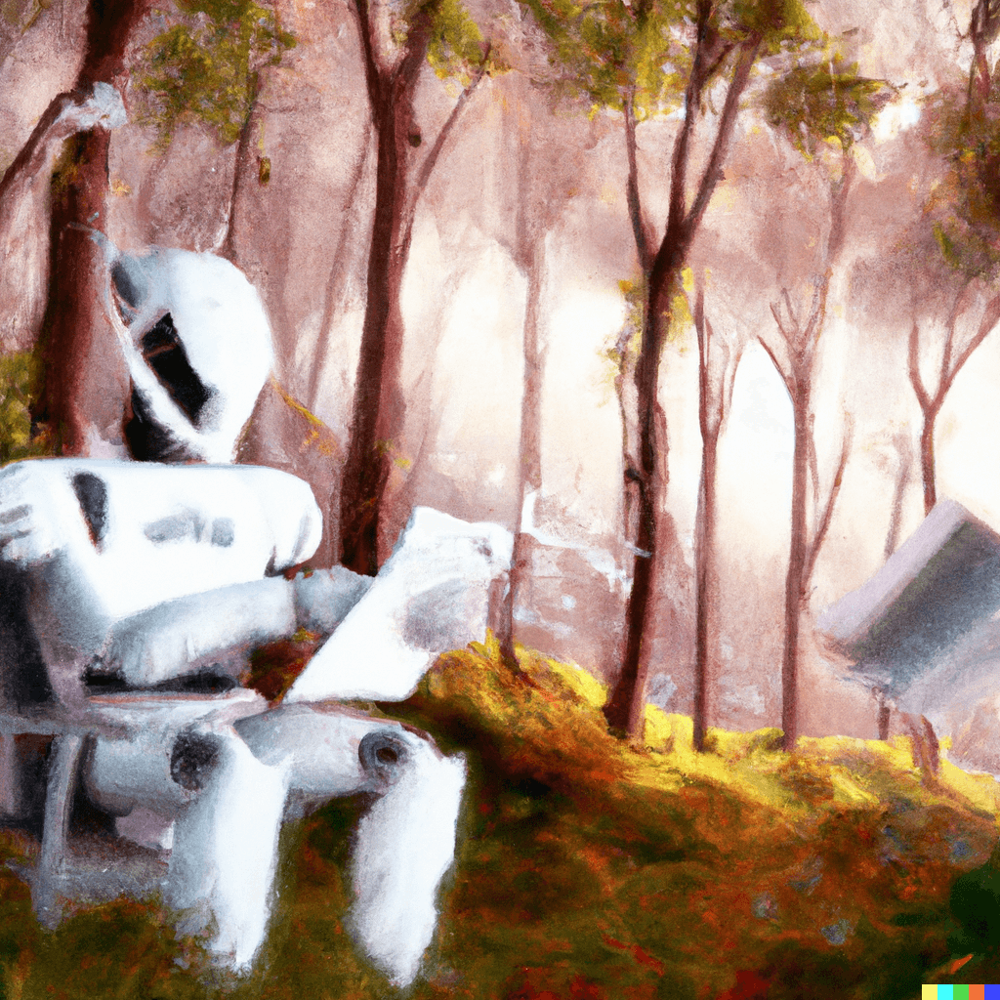

# The Elvanar Chronicles

The **Elvanar Chronicles** is a fantasy series written entirely by [OpenAI's ChatGPT](https://openai.com/blog/chatgpt/).

Some basic rules during creation:

- I was permitted to guide the AI as much or as little as I wanted, but all final content had to be authored entirely by the AI.
- I was able to use/not use certain passages created by the AI.
- I was able to retry responses or ask the AI to rewrite passages.
- All images had to similarly be created by AI through [Dall-E](https://openai.com/dall-e-2/)

## Books

- [Book 1 - Shaolin: Waking of the Legend](01-shaolin.md) - (read the [ai transcript](./ai-transcripts/01-shaolin.md))

## Copyright

All Copyright (c) belongs to OpenAI. This repository is released as is under the MIT licence.
